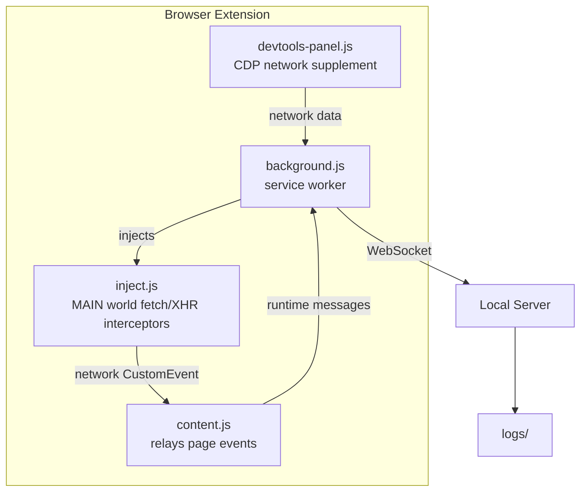
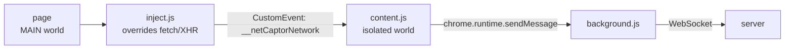

# NetCaptor

Browser monitoring extension that captures page events and streams them to a local Node.js server in real time.

## Architecture



**Extension** captures network requests (via MAIN-world injection), JS errors, navigation, user interactions, and performance metrics. **Server** receives events via WebSocket, manages per-tab sessions, and writes structured JSONL log files.

## Quick Start

### 1. Start the server

```bash
cd server
npm install
npm start
```

Server binds to `127.0.0.1:3000` and prints a random token on startup:

```
[Server] Token: 72404cf90c67117cb9fa2f2a48135c0a...
```

### 2. Load the extension

1. Open `chrome://extensions`
2. Enable **Developer mode**
3. Click **Load unpacked** → select the `extension/` directory
4. Click the extension icon, paste the **API Token** from server output
5. Click **Save & Connect**

### 3. View events

Open Chrome DevTools → **NetCaptor** panel. Events stream in real time with color-coded type filters.

## What It Captures

| Event Type | Source | Description |
|---|---|---|
| `network` | inject.js (MAIN world) | Fetch & XHR — method, URL, status, duration, size |
| `page-info` | content.js | URL, title, domain, viewport on page load |
| `navigation` | content.js + background | pushState, replaceState, popstate, hashchange, tab URL changes |
| `js-error` | content.js | Runtime errors with stack traces |
| `promise-rejection` | content.js | Unhandled promise rejections |
| `performance` | content.js | TTFB, DOMContentLoaded, load time |
| `click` | content.js | Element tag, selector, text (no form values) |
| `form-submit` | content.js | Form action, method, field names (no values) |
| `visibility-change` | content.js | Tab visibility state |
| `tab-closed` | background.js | Tab removal events |

## How Network Capture Works

Content scripts run in an isolated JavaScript world and cannot intercept the page's `window.fetch` or `XMLHttpRequest`. NetCaptor solves this by injecting a small script (`inject.js`) into the page's **MAIN world** via `chrome.scripting.executeScript({ world: "MAIN" })`.



The **page in the MAIN world** runs `inject.js` which overrides `fetch` and `XMLHttpRequest` calls.

When a network request occurs, `inject.js` creates a `CustomEvent` named `"__netCaptorNetwork"` containing the request details (method, URL, status, duration, size).

This event is caught by `content.js` running in the **isolated world** (the standard content script world).

The `content.js` then sends this event data to the background script via `chrome.runtime.sendMessage`.

Finally, the **background.js** (service worker) establishes a WebSocket connection to the **server** and streams the captured network events in real-time for logging and analysis.

## Security

The server binds to `127.0.0.1` only — it cannot be reached from other machines on the network. A random 64-character hex token is generated on startup and must be included in all connections.

| Protection | Mechanism |
|---|---|
| Network isolation | Binds to `127.0.0.1`, not `0.0.0.0` |
| HTTP auth | `X-API-Key` header required on `/sessions` and `/events` |
| WebSocket auth | `?token=` query param validated on upgrade |
| Origin check | Non-local, non-extension origins rejected |
| Token generation | `crypto.randomBytes(32)` on every startup |

## Configuration

### Server

Environment variables:

| Variable | Default | Description |
|---|---|---|
| `PORT` | `3000` | Server port |
| `API_KEY` | random | Override the auto-generated token |
| `LOG_DIR` | `./logs` | Log file directory |

### Extension

Click the extension icon to set the server URL and paste the API token shown when the server starts.

## Log Files

Logs are written as JSON Lines, organized by date:

```
logs/
└── 2026-06-09/
    ├── tab-1.log
    ├── tab-2.log
    └── tab-3.log
```

Each line:

```json
{"sessionId":"tab-123","timestamp":"2026-06-09T10:00:00.000Z","eventType":"network","payload":{"method":"GET","url":"https://api.example.com/users","status":200,"duration":250,"size":12345}}
```

## API

| Endpoint | Method | Auth | Description |
|---|---|---|---|
| `/health` | GET | No | Server status |
| `/sessions` | GET | `X-API-Key` | Active sessions |
| `/events` | POST | `X-API-Key` | Submit an event |
| WebSocket | `ws://` | `?token=` | Real-time event stream |

## License

MIT — see [LICENSE](server/LICENSE)
